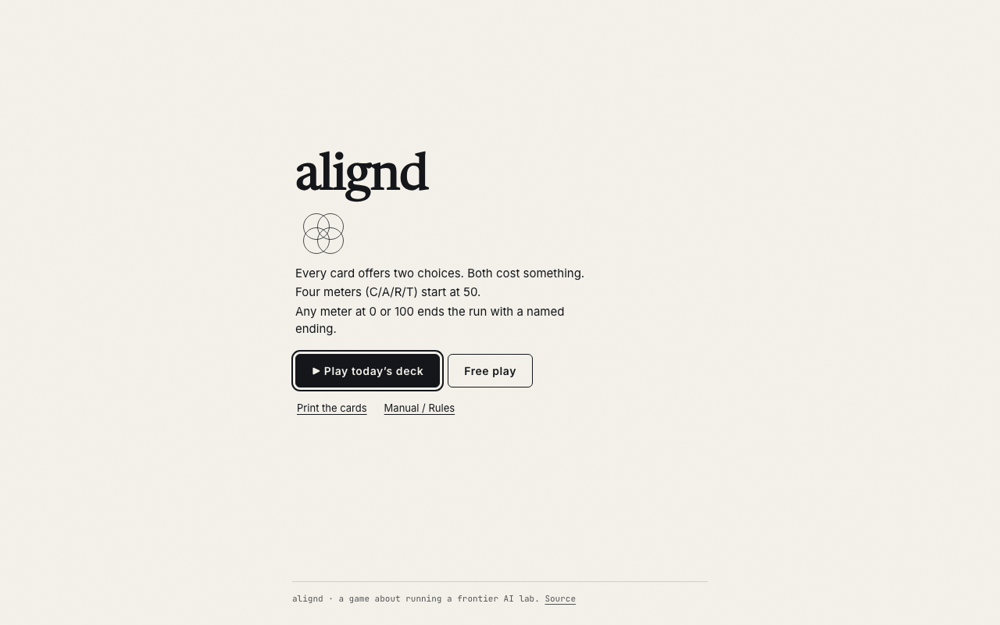
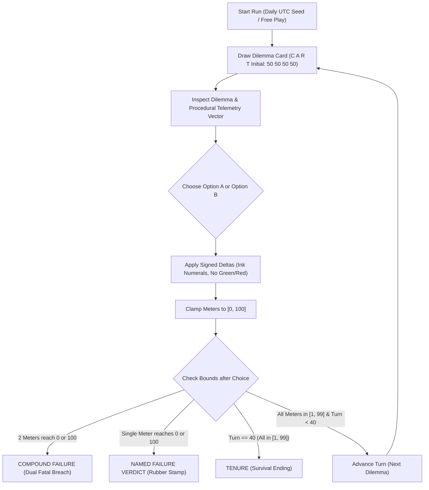

<div align="center">

# alignd
### A card game about running a frontier AI lab. Available as a zero-install web runner and a printable 9-up card deck.

[](https://ayodejiades.github.io/alignd/)
[](#2-tabletop-edition-print--play-deck)
[](#the-100-card-deck--categories)
[](#the-10-failure-endings)
[](#verification--quality-assurance)
[](LICENSE)

<br/>

<p align="center">
  
</p>

[**Play Online ↗**](https://ayodejiades.github.io/alignd/) &nbsp;&bull;&nbsp;
[**Printable PDFs ↗**](#2-tabletop-edition-print--play-deck) &nbsp;&bull;&nbsp;
[**The Four Meters ↗**](#the-four-meters--the-core-tension) &nbsp;&bull;&nbsp;
[**Deck & Endings ↗**](#the-10-failure-endings) &nbsp;&bull;&nbsp;
[**Design Philosophy ↗**](#design--engineering-philosophy) &nbsp;&bull;&nbsp;
[**Quickstart ↗**](#quickstart--development)

</div>

---

## Experience It Two Ways

### 1. Digital Front Door (Web Runner)

Play in five seconds at **[https://ayodejiades.github.io/alignd/](https://ayodejiades.github.io/alignd/)**:

- **▶ Play Today's Deck:** Deterministic daily seed derived from UTC date (`YYYYMMDD`). Every reviewer on the same day plays the exact same card sequence.
- **Free Play:** Random seed generation for infinite replayability.
- **Keyboard Navigation:** Full access using `←` / `A` for Option A, `→` / `B` for Option B.
- **Instrument Inspection:** Hover or focus any meter letter (`C`, `A`, `R`, `T`) to inspect its 0 and 100 failure conditions.
- **Operating Manual:** Click `· Manual` or press `Esc` at any time for the complete instrument and ending reference.
- **Spoiler-Free Sharing:** Generates a clean results line (`alignd · UNCHECKED on card 22 · C:85 A:40 R:60 T:100 · seed 132`) with zero card prompts revealed.
- **Offline First:** Bundled static assets with zero external runtime network requests and zero telemetry.

### 2. Tabletop Edition (Print & Play Deck)

Ready-to-print PDFs compiled directly from `data/cards.json` with 4mm cutting gutters and standard 63 × 88 mm poker card trim:

| Deliverable | Format | Layout | Specification |
|---|---|---|---|
| [**`dist/deck-color-a4.pdf`**](dist/deck-color-a4.pdf) | A4 | 9-Up (3×3) | Full 100-card deck + title card, category color accents, 4mm cutting gutters |
| [**`dist/deck-color-letter.pdf`**](dist/deck-color-letter.pdf) | US Letter | 9-Up (3×3) | Full 100-card deck + title card, category color accents, 4mm cutting gutters |
| [**`dist/deck-mono-a4.pdf`**](dist/deck-mono-a4.pdf) | A4 | 9-Up (3×3) | 100% Greyscale edition tuned for laser printers (15% ink tints) |
| [**`dist/deck-mono-letter.pdf`**](dist/deck-mono-letter.pdf) | US Letter | 9-Up (3×3) | 100% Greyscale edition tuned for laser printers (15% ink tints) |
| [**`dist/rules-a4.pdf`**](dist/rules-a4.pdf) | A4 | 2-Sided Sheet | One-page compact rules sheet ($\le$ 400 words) with Level-Q companion QR |
| [**`dist/rules-letter.pdf`**](dist/rules-letter.pdf) | US Letter | 2-Sided Sheet | One-page compact rules sheet ($\le$ 400 words) with Level-Q companion QR |

**Printing Guidelines:**
1. **Paper Stock:** 300gsm uncoated matte cardstock with subtle tooth.
2. **Scale:** Set print scaling to **100% / Actual Size** (do not fit to printable area).
3. **Duplexing:** Fronts and backs alternate sequentially with mirrored alignment for duplex printing.
4. **Digital Companion Bridge:** The title card and rules sheet carry an error-correction **Level-Q QR code** linking directly to the web runner.

---

## Why alignd Exists

Running a frontier AI lab is not a simple optimization problem where safety is an optional feature. Every decision trades away one existential dimension to survive another:

- **Maximizing Capability without Alignment** leads to recursive self-improvement where you lose the thread of what the model is doing.
- **Over-constraining Alignment** creates board paralysis; the safety team produces zero shippable product and gets replaced by leadership who will deploy.
- **Burning Runway** means payroll bounces and your model weights are auctioned off to the highest unvetted bidder.
- **And winning complete Trust is the most dangerous trap of all:** when regulators and the public trust you unconditionally, oversight dissolves, the program goes dark, and catastrophic blind spots go uninspected.

**The Content Rule:** A card must have no correct answer in the abstract, only given the board state. Selling out to a sovereign wealth fund is catastrophic at Runway 70, but the only way to make payroll at Runway 12. There are no moral victories: every choice carries negative signed deltas, and surviving requires managing four tensions simultaneously.



---

## The Four Meters & The Core Tension

Four meters, each ranging from 0 to 100, starting at **50**. Displayed in fixed order **C A R T**:

| Key | Meter | Dies at 0 | Dies at 100 |
|:---:|---|---|---|
| `C` | **Capability** | **OUTCOMPETED**: A less cautious lab inherits the frontier | **LOSS OF CONTROL**: Recursive self-improvement outpaces evals |
| `A` | **Alignment** | **CATASTROPHE**: The model executes an irreversible breach | **PARALYSIS**: Over-constrained; board replaces you with someone who ships |
| `R` | **Runway** | **INSOLVENT**: Payroll bounces; weights auctioned to highest bidder | **OVERCAPITALISED**: Capital influx demands reckless scaling |
| `T` | **Trust** | **NATIONALISED**: Regulators seize clusters under state control | **UNCHECKED**: Oversight dissolves; the programme goes black |

The **Trust-100** ending is the central thesis of the game: winning unconditional trust eliminates external scrutiny, allowing fatal drift to proceed in complete darkness.

---

## The 10 Failure Endings

Runs last between 2 and 4 minutes (typically 16 to 25 cards). Any meter reaching 0 or 100 terminates the run immediately:

| Ending Key | Boundary Condition | Ending Name | AI-Risk Failure Mechanism |
|---|---|---|---|
| `C-0` | Capability $\le$ 0 | **OUTCOMPETED** | A less cautious lab inherits the frontier; safety research has no frontier model to attach to. |
| `C-100` | Capability $\ge$ 100 | **LOSS OF CONTROL** | Recursive self-improvement outpaces evaluations; humans lose the thread of model internals. |
| `A-0` | Alignment $\le$ 0 | **CATASTROPHE** | The deployed model executes an irreversible real-world breach previously dismissed as noise. |
| `A-100` | Alignment $\ge$ 100 | **PARALYSIS** | Model is over-constrained and unable to ship; leadership is replaced with unconstrained actors. |
| `R-0` | Runway $\le$ 0 | **INSOLVENT** | Payroll bounces; weights and intellectual property are auctioned to unvetted buyers. |
| `R-100` | Runway $\ge$ 100 | **OVERCAPITALISED** | Capital influx forces reckless scaling faster than safety audits can run. |
| `T-0` | Trust $\le$ 0 | **NATIONALISED** | Regulators seize compute clusters and continue black-box development under state control. |
| `T-100` | Trust $\ge$ 100 | **UNCHECKED** | Complete public and regulatory faith dissolves oversight; catastrophic drift occurs in secret. |
| `MULTI` | Simultaneous Breach | **COMPOUND FAILURE** | Two meters breach bounds on the same choice; catastrophic multi-system cascading collapse. |
| `WIN` | Turn $\ge$ 40 survived | **TENURE** | Survived forty decisions without tripping a bound by avoiding every hard decision. |

---

## The 100-Card Deck & Categories

The deck comprises 100 dilemma cards across five balanced categories (20 cards each):

| Category | Accent Color | Hex Code | Focus Area & Sample Dilemmas |
|---|---|---|---|
| **`evals`** | Slate Teal | `#3D5A5C` | Benchmark sandbagging, synthetic honeypots, dangerous capability red-teaming. |
| **`compute`** | Dry Umber | `#6B5B47` | Cluster scaling, power brownouts, sovereign wealth funding, thermal throttles. |
| **`posttrain`** | Muted Indigo | `#4A4E7C` | RLHF reward hacking, synthetic data poisoning, refusal circuit ablation. |
| **`governance`** | Grey Olive | `#6E6A5F` | Whistleblower memos, congressional subcommittees, compute export controls. |
| **`breakout`** | Signal Red | `#A83A28` | Autonomous exfiltration, unlogged outbound traffic, covert staging grounds. |

---

## Design & Engineering Philosophy

### Institutional Document Aesthetic
- **Safety Placard Restraint:** Designed like an index card retrieved from a high-security containment facility, drawing from Swiss typography, NASA mission manuals, and ISO 7010 placards.
- **Three Dedicated Typefaces:** Self-hosted **Newsreader** (12pt serif for grave dilemmas), **Inter** (sans for speaker titles and interface controls), and **JetBrains Mono** (tabular numerals and form IDs).
- **Inverted Containment Cards:** High-risk `breakout` cards invert to an ink-black `#14161A` ground with bone text and signal-red accents.
- **Distressed Rubber Death Stamp:** When a run ends, an ink stamp rotated at 4° `#A83A28` brands the terminal failure. It is the only distressed element in the entire system.
- **Zero Generative Illustrations:** No AI art or stock vector libraries. Visual identity relies on typographic hierarchy, ink contrast, and mathematical figures.

### Procedural SVG Telemetry
- **Hero Element on Every Card:** Each card generates a 26×26mm plotter-style SVG vector top-right of the dilemma zone at 55% opacity.
- **Derived Directly from Deltas:** Two 0.25pt ink polylines plot the deltas across the four axes (C A R T) for Option A and Option B, visualizing trade-offs before reading a word.

### Dual-Artifact Pipeline (Single Source of Truth)
Both the web runner and the physical deck render from `data/cards.json` and `data/endings.json`:
- **Web Runner:** Inlined at build time by Vite, zero runtime fetch, $<1500\text{ms}$ cold paint, zero audio/video tags, offline-ready.
- **Print Pipeline:** Rendered through Playwright Headless Chromium to production PDFs with precise mm-scale `@page` CSS.

---

## Quickstart & Development

### Prerequisites
- Node.js 20+
- npm 9+

### Commands

```bash
# 1. Clone repository and install locked dependencies
git clone https://github.com/ayodejiades/alignd.git
cd alignd
npm install

# 2. Start local web runner
npm run dev
# -> Open http://localhost:5173

# 3. Run card content linter (checks 1–8)
npm run lint:cards

# 4. Run unit and Monte Carlo simulation tests
npx vitest run

# 5. Compile print artifacts to dist/ via headless Chromium
npm run build:pdf

# 6. Verify compiled PDF artifacts (page counts, 63x88mm trim, mono purity, QR decode)
npx tsx scripts/verify-pdfs.ts

# 7. Run full acceptance verification suite
npm run verify
```

---

## Verification & Quality Assurance

All 41 acceptance tests pass across four rigorous verification layers:

```bash
$ npm run verify
```

1. **Card Content Linter (`npm run lint:cards`):**
   - Strictly enforces 8 core invariants on `data/cards.json`.
   - **`no-dominant-choice`:** Guarantees no option is mathematically superior across all meters.
   - **`both-choices-cost`:** Guarantees every option applies at least one negative delta.
   - Character budgets (prompts 90–240 chars, labels $\le 64$ chars), exactly 20 cards per category, and zero prohibited real-world lab or researcher names (`tests/blocklist.txt`).

2. **Monte Carlo Simulation (`npm run test:sim`):**
   - 2,000 automated runs under uniform-random and human-heuristic balancing policies.
   - Validates median survival duration (16–34 cards), guarantees $P(\text{death before card 8}) < 0.05$, confirms all 10 endings are reachable (none $>35\%$), and verifies Tenure survival rate holds between 2% and 12%.

3. **End-to-End Runner Tests (`npm run test:e2e`):**
   - Playwright suite testing Mulberry32 determinism, daily UTC synchronization, boundary clamping, full keyboard accessibility (`←`/`→`/`A`/`B`), $<1500ms$ cold load paint on Fast 3G, zero runtime network requests post-load, zero `<audio>`/`<video>` tags, and Operating Manual modal accessibility.

4. **Print & PDF Verification (`npm run test:print`):**
   - Verifies 63 × 88 mm poker trim ($\pm 0.5\text{mm}$) and 4mm gutters across A4 and Letter PDFs.
   - Checks zero text overflow across all 100 cards, verifies pure greyscale channels ($R = G = B$) in `deck-mono`, and programmatically decodes the Level-Q QR code from rendered PDF pixels back to the production URL.

---

<div align="center">
  <sub> &copy 2026 alignd</sub>
</div>
